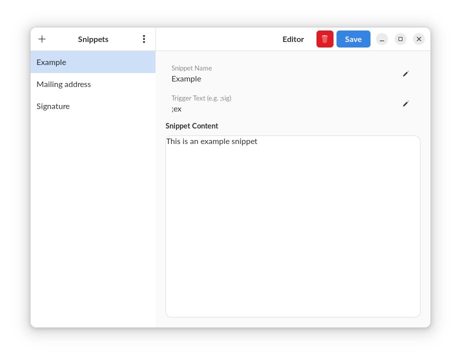
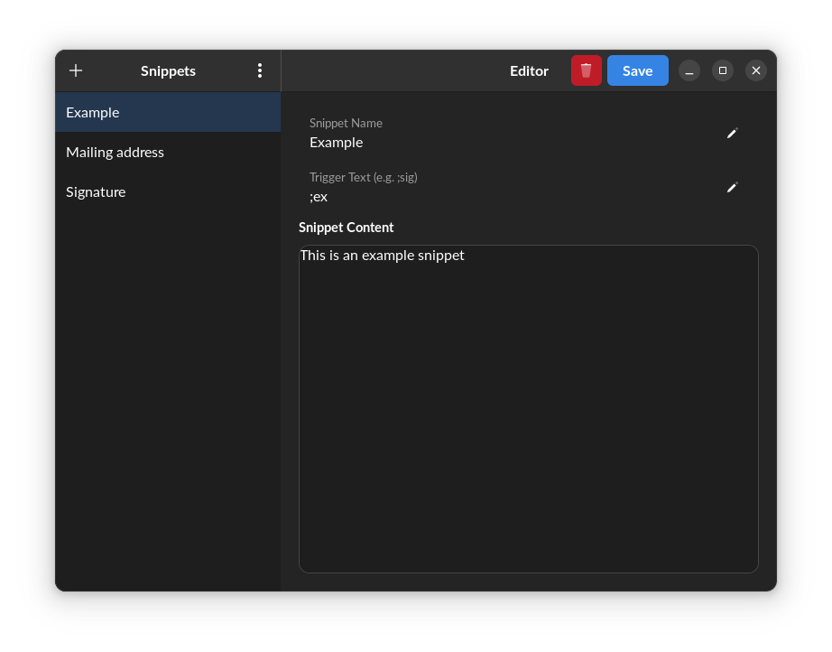
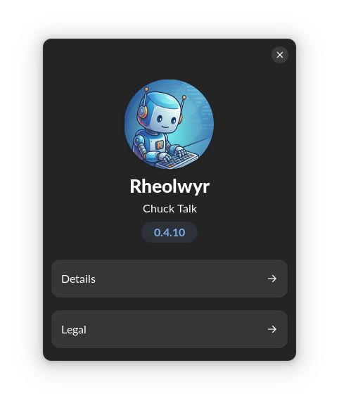
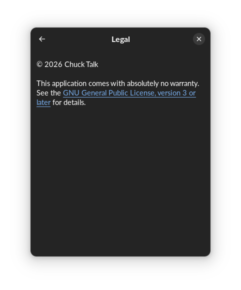

#  Rheolwyr

Linux text expander.
Version 0.4.1
Rheolwyr ("Manager" in Welsh) is a Linux-native text snippet manager designed for Pop!_OS Cosmic and GNOME on Wayland.

## Features

- **Text Expansion**: Automatically expands keywords into snippets.
- **Global Shortcuts**: Trigger snippets from any application.
- **Split-View Editor**: Manage and edit snippets easily.
- **Theme persistence**: Remembers your preferred theme.
- **System Tray Support**: Runs in the background.
- **Wayland & X11 Support**: Designed with modern Linux desktop standards.

## Screenshots

> **Note**: To add screenshots, place your image files in `docs/images/` and reference them here.

### Main Interface
*(Place `main_interface.png` in `docs/images/` and uncomment the line below)*
 




## Installation

1. Install system dependencies:

   ```bash
   sudo apt install libcairo2-dev libgirepository1.0-dev pkg-config python3-dev xclip wl-clipboard
   ```

2. Install python dependencies:

   ```bash
   pip install -r requirements.txt
   ```

2. Run the application:

   ```bash
   python -m rheolwyr.main
   # Or after pip install .
   rheolwyr
   ```

## Tech Stack

- Python 3
- GTK4 + Libadwaita
- SQLite

## Packaging

### Debian / Ubuntu

Build using `dpkg-buildpackage`:

```bash
dpkg-buildpackage -us -uc
```

### Flatpak

Build using `flatpak-builder`:

```bash
flatpak-builder --user --install build-dir com.taliskerman.rheolwyr.yml
```


## Setup & Troubleshooting

### Enabling Text Expansion (Wayland/Input)

For text expansion to work, especially on Wayland, your user needs permission to monitor input devices and inject keys. The package installs a udev rule for `uinput`, but you must manually add your user to the required groups.

1.  **Add your user to the `input` and `uinput` groups**:

    ```bash
    sudo usermod -aG input,uinput $USER
    ```

2.  **Log out and log back in**:
    Group changes **will not take effect** until you log out of your desktop session and log back in (or reboot).

### Common Issues

-   **"Snippet not expanding"**:
    -   Verify you are in the groups: run `groups` and look for `input` and `uinput`.
    -   Ensure `rheolwyr` is running (check system tray).
    -   If on Wayland, ensure you are not using a confined Flatpak without proper permissions (native `.deb` package recommended for best compatibility).

## License

GPLv3
