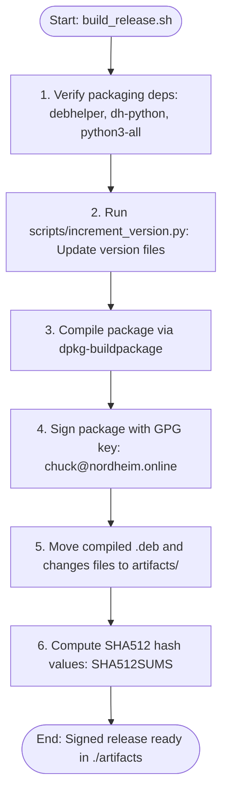
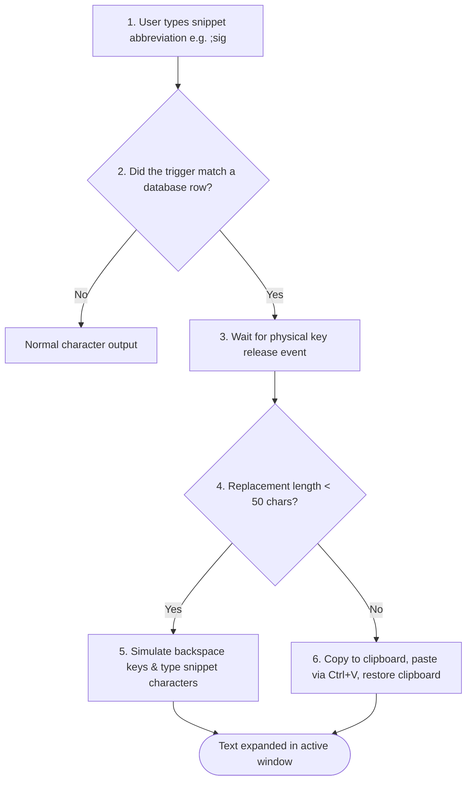

# Rheolwyr — Text Expander & Hardening Manual

Welcome to **Rheolwyr** (Welsh for "Manager," pronounced *Hre-aw-lur*). Rheolwyr is a native, high-performance text expansion and snippet utility designed specifically for GNOME and Cosmic desktop environments on Linux.

Built on the core principles of privacy and control, Rheolwyr keeps your snippets localized, secure, and entirely within your domain.

---

## 🔒 1. Privacy & Telemetry Disclosures

*   **Zero Telemetry:** Snippets never leave your computer. We do not log keystrokes to the cloud or track your writing habits.
*   **Log Privacy:** Snippet bodies are never leaked into the systemd journal or logs. Logging is silent by default.
*   **Local Caching:** All snippets are stored securely in a local SQLite database at `~/.local/share/rheolwyr/snippets.db` (respecting `XDG_DATA_HOME`).
*   **Independent Clipboard:** Clipboard handling is executed locally using native system binaries (`wl-clipboard` / `xclip`), completely bypassing external library dependencies.

---

## 🚀 2. Core Capabilities & Expansion Modes

Rheolwyr intercepts abbreviation triggers (e.g. `;sig`) and replaces them with configured text. **Note:** Expansion requires a word boundary (space or tab), so typing a longer word will not accidentally fire a substring trigger (e.g., typing `address` will not trigger an `addr ` snippet).

### Expansion Modes

Rheolwyr dynamically adjusts its insertion mechanism based on the size of the replacement string to ensure optimal performance and sandboxing compatibility:

| Expansion Mode | Trigger Threshold | Operation | Compatibility |
| :--- | :--- | :--- | :--- |
| **Keystroke Simulation** | Snippets < 50 characters | Simulates typing each individual letter. | Highly compatible; works inside secure Wayland sandboxes and strict terminal grids. |
| **Clipboard Injection** | Snippets 50+ characters | Copies text to clipboard, fires `Ctrl+V` paste commands, and safely restores previous clipboard history (including binary content like images). | Designed for long paragraphs and code block boilerplates. |

---

## ⚙️ 3. Wayland & Cosmic Configuration (CRITICAL)

To capture keystrokes and inject text on modern Wayland desktop sessions, your user account must have permissions to access Linux `uinput` nodes.

### Setup Instructions
1.  **Add User to Input Groups:**
    ```bash
    sudo usermod -aG input,uinput $USER
    ```
    > [!WARNING]
    > **Security Disclosure:** Adding your user to the `input` group grants read access to every keystroke from every application system-wide. This is an explicit opt-in. For higher security, consider least-privilege alternatives (e.g., a dedicated service user, scoping udev device rules, or running X11-only).
2.  **Apply Group Permissions:**
    > [!IMPORTANT]
    > **Log Out Required:** You must completely log out of your desktop session and log back in (or reboot the system) for the group membership changes to take effect.

### Dropped Character Wayland Safeguard (v0.4.11+)
Legacy Linux expanders often suffer from character dropout when typing quickly on Wayland. Rheolwyr v0.4.11+ resolves this by explicitly waiting for physical key release events before executing the expansion sequence, guaranteeing zero character dropouts.

---

## 💾 4. Installation & Verification

Rheolwyr is packaged and distributed natively as a Debian package (`.deb`).

```bash
# Install the package and resolve required clipboard tools (xclip / wl-clipboard)
sudo apt install ./rheolwyr_*_all.deb
```

---

## 🛠️ 5. Technical Stack & Dependencies

| Component | Library / Package | Role |
| :--- | :--- | :--- |
| **UI Framework** | PyGObject (GTK4 + Libadwaita) | Delivers GNOME/Cosmic native desktop layout aesthetics. |
| **Keystroke Tracker** | `pynput` | Listens for keyboard triggers. |
| **Key Injector** | `evdev` | Synthesizes expansion outputs via `uinput`. |
| **Clipboard (Wayland)** | `wl-clipboard` | Manages clipboard data copy/paste operations on Wayland. |
| **Clipboard (X11)** | `xclip` | Manages clipboard data copy/paste operations on X11. |

---

## 🏗️ 6. Automated Packaging & Release Pipeline

Rheolwyr compiles and signs production bundles automatically via `build_release.sh`:



To verify the integrity and authenticity of the release package:
```bash
# Check the SHA512 checksum list
cd artifacts
sha512sum -c SHA512SUMS
```

---

## 🔄 7. Workstation Telemetry Architecture



---
*Rheolwyr is distributed under the GNU General Public License v3.*
